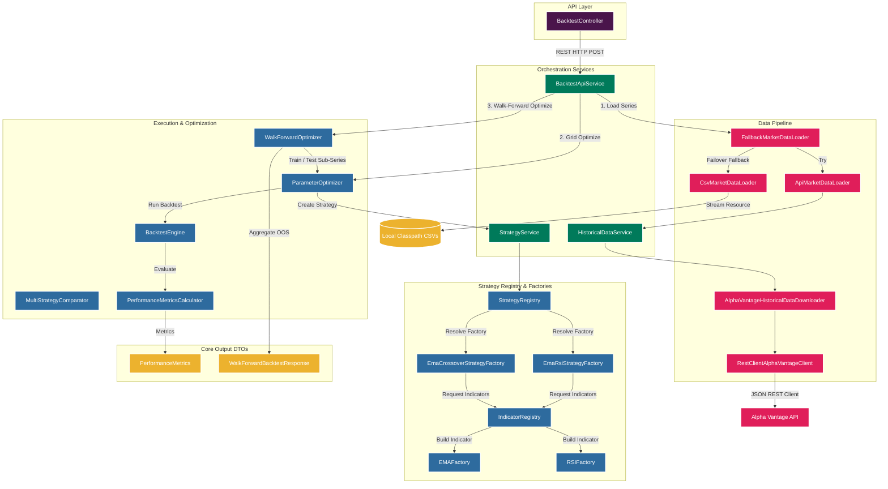

# Quantitative Trading Strategy & Backtesting Engine

[](#)
[](https://www.oracle.com/java/technologies/downloads/#java21)
[](https://spring.io/projects/spring-boot)
[](https://github.com/ta4j/ta4j)

A high-performance, robust, and clean-architecture quantitative trading strategy development, backtesting, and parameter optimization engine. Built with **Spring Boot 3.5.6**, **Java 21**, and the **TA4J** technical analysis library, this application provides an enterprise-ready environment for designing mechanical trading strategies, optimizing parameters across historical datasets, and performing walk-forward out-of-sample validations.

---

## 📌 Project Purpose & Real-World Use Case

In quantitative finance, evaluating trading strategies solely on training data leads to **overfitting** (curve-fitting), where strategies perform exceptionally well on past data but fail in live market conditions. 

This engine solves this problem by providing a modular, extensible backtesting framework that:
1. **Orchestrates Market Data**: Connects directly to external market data APIs (Alpha Vantage) with an automatic failover to local CSV files if API rate limits are reached.
2. **Backtests Strategies Mechanically**: Simulates order execution against historical OHLCV (Open, High, Low, Close, Volume) bar series under mathematical rules.
3. **Optimizes Parameters (Grid Search)**: Dynamically scans indicator configurations to find optimal historical setups.
4. **Validates Out-of-Sample (Walk-Forward Optimization)**: Slides training and testing windows across historical timelines to verify that optimized parameters yield positive returns on unseen data.
5. **Compares Multiple Strategies**: Ranks strategies on a risk-adjusted basis using metrics such as Win Rate, Profit Factor, and Maximum Drawdown.

---

## 🚀 Key Features

* **Market Data Loaders with Automatic Failover**: A composite data pipeline that attempts to fetch daily historical data from the Alpha Vantage API first and automatically falls back to local CSV files on the classpath if the API is unavailable or rate-limited.
* **Modular Indicator & Strategy Registry**: Built using the Factory and Registry patterns to allow dynamic creation of indicators (EMA, RSI) and strategies (EMA Crossover, EMA-RSI Momentum) using custom parameters.
* **Grid Search Parameter Optimization**: Scans combinations of fast/slow EMA periods and RSI threshold boundaries to locate configuration profiles yielding maximum gross profit.
* **Sliding Walk-Forward Optimization (WFO)**: Performs sequential walk-forward window analysis (e.g., 50 bars training / 25 bars testing / 25 bars step size) to generate out-of-sample metrics.
* **Risk-Aware Multi-Strategy Comparator**: A comparison engine that ranks different strategy outputs based on multiple performance priorities (Total Earnings $\rightarrow$ Profit Factor $\rightarrow$ Win Rate $\rightarrow$ Maximum Drawdown).
* **Comprehensive Performance Metrics**: Calculates mathematical metrics from trading records: Total Trades, Winning/Losing Trades, Win Rate, Gross Profit, Gross Loss, Net Earnings, Average Profit, Maximum Drawdown, and Profit Factor.
* **Enterprise REST API**: Exposes JSON endpoints to configure, trigger, and inspect backtesting and walk-forward workflows.

---

## 🏗️ Architecture & Component Design

The engine adheres to clean-architecture principles, separating domain logic, configuration, infrastructure data access, and API controllers.

### Architecture Diagram (Mermaid)



### Important Design Decisions
* **Separation of Registry and Factory**: Indicators and strategies are decoupled from their construction logic. `IndicatorRegistry` and `StrategyRegistry` resolve target factories at runtime, allowing new technical indicators or rules to be plugged in without refactoring core services.
* **Separation of Metrics from Calculation**: `PerformanceMetrics` is a simple immutable data holder. Calculation logic resides within `PerformanceMetricsCalculator`, allowing unit testing of mathematical formulas without requiring complex mocks of the data model.
* **Composite Data Loading (`FallbackMarketDataLoader`)**: The loader uses a composite fallback strategy. It prioritizes the latest market data via `ApiMarketDataLoader` but intercepts any HTTP, rate-limiting, or symbol-resolution errors, seamlessly reverting to local file-based `CsvMarketDataLoader` to guarantee test and runtime stability.
* **Thread-Safe Immutable DTOs**: Internal models like `StrategyConfig` and responses like `WalkForwardBacktestResponse` use strict encapsulation and validation in constructors, ensuring thread safety and preventing side-effect parameter mutations during parallel optimization scans.

---

## 📂 Project Structure Tree

Below is the directory layout of the Quantitative Trading Engine codebase:

```text
demo/
├── pom.xml                                      # Maven Build Specification
└── src/
    ├── main/
    │   ├── java/com/rithish/trading/
    │   │   ├── config/
    │   │   │   ├── AlphaVantageProperties.java  # Binds "alpha-vantage" properties from environment
    │   │   │   └── StrategyConfig.java          # Immutable configuration for strategy indicators
    │   │   ├── contracts/
    │   │   │   ├── AlphaVantageClient.java      # Interface for HTTP operations
    │   │   │   ├── HistoricalDataDownloader.java# Interface for downloader component
    │   │   │   ├── IndicatorFactory.java        # Factory contract for building TA4J indicators
    │   │   │   ├── MarketDataLoader.java        # Core market data loading abstraction
    │   │   │   └── StrategyFactory.java         # Factory contract for strategy construction
    │   │   ├── controller/
    │   │   │   └── BacktestController.java      # REST Endpoints for execution and optimization
    │   │   ├── dto/
    │   │   │   ├── api/
    │   │   │   │   ├── BacktestRequest.java     # REST API Request payload DTO
    │   │   │   │   ├── BacktestResponse.java    # REST API Response payload DTO
    │   │   │   │   ├── Dataset.java
    │   │   │   │   ├── HistoricalResponse.java
    │   │   │   │   ├── WalkForwardBacktestResponse.java # Out-of-sample results container
    │   │   │   │   └── WalkForwardWindowResponse.java   # Single window metrics container
    │   │   │   └── historical/
    │   │   │       └── HistoricalCandle.java    # Standard internal OHLCV candle representation
    │   │   ├── engine/
    │   │   │   └── BacktestEngine.java          # Coordinates TA4J BarSeriesManager runs
    │   │   ├── exceptions/
    │   │   │   ├── BacktestExecutionException.java
    │   │   │   ├── GlobalExceptionHandler.java  # REST global error handler
    │   │   │   └── HistoricalDataDownloadException.java
    │   │   ├── indicator/
    │   │   │   ├── EMAFactory.java
    │   │   │   ├── IndicatorRegistry.java       # Registry mapping IndicatorTypes to factories
    │   │   │   └── RSIFactory.java
    │   │   ├── loader/
    │   │   │   ├── ApiMarketDataLoader.java     # Loads series from AlphaVantage via JSON mapper
    │   │   │   ├── CsvMarketDataLoader.java     # Parse daily candles from classpath CSV files
    │   │   │   └── FallbackMarketDataLoader.java# Coordinates API loading with local CSV failover
    │   │   ├── model/
    │   │   │   ├── IndicatorType.java           # Enum listing indicators (EMA, RSI)
    │   │   │   └── StrategyType.java            # Enum listing strategies (EMA_RSI, EMA_CROSSOVER)
    │   │   ├── optimizer/
    │   │   │   ├── MultiStrategyComparator.java # Rates and ranks multiple strategies
    │   │   │   ├── ParameterOptimizer.java      # Grid searches optimal indicator parameters
    │   │   │   ├── StrategyComparisonResult.java
    │   │   │   ├── StrategyOptimizer.java
    │   │   │   └── WalkForwardOptimizer.java    # Sliding training/testing walk-forward engine
    │   │   ├── report/
    │   │   │   ├── PerformanceMetrics.java      # Performance stats container
    │   │   │   ├── PerformanceMetricsCalculator.java # Calculates metrics from TradingRecord
    │   │   │   ├── PerformanceReportService.java# Formats and prints backtest reports to console
    │   │   │   └── TradeReportService.java      # Prints detailed entry/exit logs to console
    │   │   ├── service/
    │   │   │   ├── downloader/
    │   │   │   │   ├── AlphaVantageHistoricalDataDownloader.java # Downloads and parses JSON
    │   │   │   │   └── RestClientAlphaVantageClient.java         # Spring Boot 3.5.x RestClient
    │   │   │   └── impl/
    │   │   │       ├── BacktestApiService.java  # Controller-facing REST orchestrator
    │   │   │       ├── HistoricalDataService.java# Intermediary downloader orchestrator
    │   │   │       └── StrategyService.java      # Intermediary strategy builder orchestrator
    │   │   ├── util/
    │   │   │   └── CsvWriter.java               # Writes candles data to CSV format
    │   │   └── App.java                         # Main class / Bootstrap
    │   └── resources/
    │       └── application.yml                  # Config file mapping environment vars
```

---

## 📈 Supported Components & Calculations

### 1. Market Data Loading
The engine runs daily OHLCV bar series. It normalizes data across time zones (using `Asia/Kolkata` as default market time).
* **API Ingestion**: Downloads data from Alpha Vantage via the `TIME_SERIES_DAILY` query function using a `compact` payload size (providing approx. the last 100 daily bars). It resolves Indian Equities by suffixing symbols with `.NSE` or `.BSE` (e.g., `TCS.NSE`).
* **CSV Parsing**: Parsed via `CsvMarketDataLoader` using classpath resources under `historical/NSE/{SYMBOL}.csv`. It validates the OHLC relationship ($Low \le Open, Close \le High$) and enforces strict ascending chronological date ordering. Duplicate date rows and event adjustments (e.g., dividends) are skipped gracefully without aborting execution.

### 2. Technical Indicators & Strategies
All strategies use `ta4j-core` components:
* **EMA (Exponential Moving Average)**: Built from close price indicators.
* **RSI (Relative Strength Index)**: Identifies momentum strength.
* **EMA Crossover Strategy**:
  * **Entry**: Fast EMA crosses above Slow EMA.
  * **Exit**: Fast EMA crosses below Slow EMA.
* **EMA + RSI Momentum Strategy** (Optimized):
  * **Entry**: Fast EMA crosses above Slow EMA **AND** RSI is above the specified buy threshold.
  * **Exit**: Fast EMA crosses below Slow EMA **OR** RSI falls below the specified sell threshold.

### 3. Backtesting & Metric Calculation
The `BacktestEngine` runs the strategy against the daily bars using TA4J's `BarSeriesManager` to produce a `TradingRecord`. The `PerformanceMetricsCalculator` parses this record to compute the following metrics:

| Metric | Calculation / Description |
| :--- | :--- |
| **Total Trades** | Number of completed round-trip trades (entry to exit). |
| **Win Rate** | $\frac{\text{Winning Trades}}{\text{Total Trades}}$ |
| **Total Profit** | Gross profit accumulated from positive trades. |
| **Total Loss** | Gross loss accumulated from negative trades. |
| **Total Earnings** | $\text{Gross Profit} - \text{Gross Loss}$ |
| **Average Profit** | $\frac{\text{Total Earnings}}{\text{Total Trades}}$ |
| **Maximum Drawdown** | The peak-to-trough decline in portfolio equity. Calculated using `MaximumDrawdownCriterion`. |
| **Profit Factor** | $\frac{\text{Gross Profit}}{\text{Gross Loss}}$. Values $> 1$ indicate profitable strategies. |

### 4. Parameter Optimization (Grid Search)
The `ParameterOptimizer` performs a comprehensive grid search to select the configuration that maximizes historical net profit. 

The default search space covers:
* **Fast EMA**: 9, 10, 12 periods
* **Slow EMA**: 20, 21, 26 periods (validates that $Slow > Fast$)
* **RSI Period**: 14
* **RSI Buy Threshold**: 50.0, 55.0, 60.0
* **RSI Sell Threshold**: 40.0, 45.0, 50.0 (validates that $Buy > Sell$)

### 5. Walk-Forward Optimization
The `WalkForwardOptimizer` divides historical bar series into sliding windows:
1. **Training Window (50 bars)**: Runs the grid search `ParameterOptimizer` on this sub-series to select the best parameters.
2. **Testing Window (25 bars)**: Instantiates the strategy using the optimized parameters and runs it on the subsequent unseen 25-bar out-of-sample dataset.
3. **Sliding Step Size (25 bars)**: Moves the window forward by 25 bars and repeats until it reaches the end of the series.
4. **Aggregation**: Sums the out-of-sample profit across all windows to evaluate real robustness.

### 6. Multi-Strategy Comparison
The `MultiStrategyComparator` evaluates multiple strategies concurrently on the same dataset. It ranks strategies using a risk-adjusted priority matrix:
1. **Net Earnings** (Highest Priority)
2. **Profit Factor**
3. **Win Rate**
4. **Maximum Drawdown** (Lowest Drawdown is preferred)

---
---

## Error Handling

`GlobalExceptionHandler` (`@RestControllerAdvice`) maps exceptions to consistent payloads.

| Exception | Status | `error` |
| --- | --- | --- |
| `IllegalArgumentException` | `400 Bad Request` | `Bad Request` |
| `HistoricalDataDownloadException` | `404 Not Found` | `Historical Data Not Found` |
| `BacktestExecutionException` | `500 Internal Server Error` | `Backtest Execution Failed` |
| `Exception` (catch-all) | `500 Internal Server Error` | `Internal Server Error` |

```json
{
  "timestamp": "2026-08-31T12:26:04.118",
  "status": 404,
  "error": "Historical Data Not Found",
  "message": "Historical data not available for FOO on NSE or BSE",
  "path": "/api/backtest"
}
```

The catch-all returns a generic message so internal details are never leaked to clients, while the full stack trace is logged server-side.

---
---

## Testing

**96 tests across 17 classes, all passing.**

```bash
cd Quantitative-Trading-Engine/demo && mvn test
```

| Test class | Tests | Covers |
| --- | --- | --- |
| `StrategyConfigTest` | 14 | Every validation invariant and boundary |
| `WalkForwardOptimizerTest` | 12 | Window arithmetic, insufficient-data guards, profit aggregation |
| `AlphaVantageHistoricalDataDownloaderTest` | 8 | Exchange fallback, rate-limit detection, malformed JSON |
| `ApiMarketDataLoaderTest` | 8 | Symbol normalization, empty responses, series construction |
| `FallbackMarketDataLoaderTest` | 8 | API → CSV degradation and both-failed paths |
| `CsvMarketDataLoaderTest` | 6 | Malformed rows, duplicate dates, ordering, OHLC validation |
| `PerformanceMetricsCalculatorTest` | 6 | Win rate, profit factor, zero-trade and no-loss edge cases |
| `BacktestEngineTest` | 5 | Null/empty validation, execution, exception wrapping |
| `EmaRsiStrategyFactoryTest` | 5 | Rule construction and warm-up guards |
| `ParameterOptimizerTest` | 5 | Grid traversal, invalid-combination skipping, best-config selection |
| `MultiStrategyComparatorTest` | 4 | Risk-aware ranking priority |
| `PerformanceReportServiceTest` | 4 | Report formatting |
| `TradeReportServiceTest` | 4 | Trade detail and open-position output |
| `IndicatorRegistryTest` | 3 | Lookup and unknown-type failure |
| `StrategyRegistryTest` | 2 | Lookup and unknown-type failure |
| `HistoricalDataServiceTest` | 1 | API key propagation |
| `StrategyEngineSmokeTest` | 1 | End-to-end CSV → strategy → engine signal generation |

External HTTP is mocked with Mockito at the `AlphaVantageClient` boundary, so the suite runs offline and without consuming API quota.

> **Note:** `CsvMarketDataLoaderTest` and `StrategyEngineSmokeTest` read CSV fixtures from `demo/src/main/resources/historical/NSE/`. See [Known Limitations](#known-limitations) — these files are currently excluded by `.gitignore`.

---

## 🛠️ Technology Stack & Dependencies

The project is built on the following stack (defined in [pom.xml](file:///c:/Users/LENOVO%20CORE%20I7/Downloads/Quantitative-Trading-Engine-main%20%281%29/Quantitative-Trading-Engine-main/demo/pom.xml)):
* **Language/Platform**: Java 21 (properties set to version 21)
* **Framework**: Spring Boot 3.5.6 (with Web starter)
* **Core Libraries**:
  * `ta4j-core` (v0.18) - Technical Analysis and Backtesting Engine
  * `jackson-databind` - JSON Serialization/Deserialization
  * `lombok` - Boilerplate generation (Getter, RequiredArgsConstructor, etc.)
  * `spring-webflux` - Integration testing client runtime support
* **Testing Suite**: Spring Boot Starter Test (JUnit 5, Mockito)

---

## 💻 Project Setup & Configuration

### Environment Variables & Credentials
The application requires an Alpha Vantage API key to fetch historical daily price charts. 
1. Get a free API key from [Alpha Vantage](https://www.alphavantage.co/support/#api-key).
2. Set the key as an environment variable in your terminal session:

**Windows (PowerShell):**
```powershell
$env:ALPHA_VANTAGE_API_KEY="YOUR_ALPHA_VANTAGE_API_KEY"
```

**Linux / macOS:**
```bash
export ALPHA_VANTAGE_API_KEY="YOUR_ALPHA_VANTAGE_API_KEY"
```

### Installation
Clone the repository and build the jar package from the `demo` directory using Maven:
```bash
# Navigate to the maven project directory
cd demo

# Build the project, running compilation and package compilation
mvn clean package -DskipTests
```
*(Note: To build the jar package, skip tests or supply local CSV assets first, as described in the Limitations section below)*.

### Run Application
Launch the Spring Boot application:
```bash
mvn spring-boot:run
```
By default, the server boots up on port `8080`.

### Running Unit & Smoke Tests
The repository contains 17 unit/smoke tests validating the registries, metrics calculator, optimizers, and data loader classes. Run them using:
```bash
mvn test
```

---

## 🔌 REST API Documentation

### 1. Standard Backtest and Parameter Optimization
Grid-searches the best parameter configuration for the target symbol, executes the backtest on the full series, and returns the optimized performance metrics.

* **Endpoint**: `POST /api/backtest`
* **Content-Type**: `application/json`
* **Request Payload**:
  ```json
  {
    "symbol": "TCS"
  }
  ```

* **Example Response (HTTP 200 OK)**:
  ```json
  {
    "symbol": "TCS",
    "performanceMetrics": {
      "totalTrades": 12,
      "winningTrades": 7,
      "losingTrades": 5,
      "winRate": 0.5833333333333334,
      "totalProfit": 543.4,
      "totalLoss": 408.65,
      "totalEarnings": 134.75,
      "averageProfit": 11.229166666666666,
      "maximumDrawdown": 12.5002048593883,
      "profitFactor": 1.3297442800685183
    }
  }
  ```

---

### 2. Walk-Forward Backtesting
Performs walk-forward optimization across sliding training and testing windows to report out-of-sample trading outcomes.

* **Endpoint**: `POST /api/backtest/walk-forward`
* **Content-Type**: `application/json`
* **Request Payload**:
  ```json
  {
    "symbol": "TCS"
  }
  ```

* **Example Response (HTTP 200 OK)**:
  ```json
  {
    "symbol": "TCS",
    "windowsEvaluated": 2,
    "totalOutOfSampleProfit": 45.30,
    "results": [
      {
        "windowNumber": 1,
        "trainingStart": 0,
        "trainingEnd": 50,
        "testingStart": 50,
        "testingEnd": 75,
        "fastEmaPeriod": 9,
        "slowEmaPeriod": 21,
        "rsiPeriod": 14,
        "rsiBuyThreshold": 55.0,
        "rsiSellThreshold": 45.0,
        "testingProfit": 18.40,
        "completedTrades": 3
      },
      {
        "windowNumber": 2,
        "trainingStart": 25,
        "trainingEnd": 75,
        "testingStart": 75,
        "testingEnd": 100,
        "fastEmaPeriod": 10,
        "slowEmaPeriod": 26,
        "rsiPeriod": 14,
        "rsiBuyThreshold": 60.0,
        "rsiSellThreshold": 50.0,
        "testingProfit": 26.90,
        "completedTrades": 4
      }
    ]
  }
  ```

---

## ⚠️ Important Limitations & Assumptions

* **Fallback CSV Data Setup**: The project's tests and its `CsvMarketDataLoader` look for local CSV files under the classpath resources directory `demo/src/main/resources/historical/NSE/{SYMBOL}.csv` (e.g., `TCS.csv`). **These CSV datasets are not shipped in this repository by default.**
  > [!IMPORTANT]
  > To run unit tests (`mvn test`) or run backtests without an active internet connection/API key, you must manually create the folder `demo/src/main/resources/historical/NSE/` and place a `TCS.csv` file inside it formatted as:
  > ```csv
  > Date,Open,High,Low,Close,Volume
  > 2026-08-01,3400.0,3450.0,3390.0,3420.0,120000
  > 2026-08-02,3420.0,3480.0,3410.0,3470.0,150000
  > ```
* **Alpha Vantage API Limits**: The default free API key for Alpha Vantage is subject to tight rate limits (e.g., 25 requests per day). Excessive sequential calls via `POST /api/backtest` will trigger the API's rate-limiting "Note", forcing the engine to fallback to CSV files.
* **Fixed Walk-Forward Parameters**: Walk-forward parameters are hardcoded in the `BacktestApiService` constructor: Training Window = 50 bars, Testing Window = 25 bars, Step Size = 25 bars. These are tailored to Alpha Vantage's compact daily output (~100 daily candles) and cannot be adjusted on a per-request basis.
* **No Transaction Costs/Slippage**: The backtesting engine assumes zero slippage and zero broker commissions. Performance reports represent gross theoretical results.

---

## 🔮 Future Enhancements

---

## 🔗 Integration with Real-Time Stock Portfolio

This Quantitative Trading Engine is designed as a standalone quantitative analysis and backtesting module and is being integrated into a separate **Real-Time Stock Portfolio** application.

The integration allows users to select a stock symbol from the stocks available in the portfolio platform and request quantitative analysis for that selected stock.

### Integration Flow

```text
Real-Time Stock Portfolio
            │
            ▼
     User selects stock
       (e.g. TCS)
            │
            ▼
   Quantitative Analysis API
            │
            ▼
     Historical OHLCV Data
            │
       ┌────┴─────┐
       │          │
       ▼          ▼
   API Data    CSV Data
       │          │
       └────┬─────┘
            ▼
      TA4J BarSeries
            │
            ▼
       Backtest Engine
            │
       ┌────┼──────────────┐
       ▼    ▼              ▼
   Strategy  Parameter   Walk-Forward
   Testing   Optimization Optimization
       │        │              │
       └────────┼──────────────┘
                ▼
       Performance Metrics
                │
                ▼
       Quantitative Result
                │
                ▼
     Real-Time Stock Portfolio

```
Planned Application-Level Integration

The Real-Time Stock Portfolio application manages the user-facing stock and portfolio functionality, while this engine provides quantitative analysis capabilities.

The integration is designed around the following responsibilities:

Real-Time Stock Portfolio
User authentication and authorization
Stock catalogue managed by administrators
Current market prices
Portfolio and holdings
Transactions
Alerts and notifications
User-facing dashboard
Quantitative Trading Engine
Historical market-data processing
Technical indicators
Strategy execution
Backtesting
Parameter optimization
Walk-forward validation
Performance analysis

The stock symbol selected by the user will be validated against the stocks available in the portfolio application before quantitative analysis is executed.

Future AI Integration

A future AI layer will consume the quantitative results and market information to provide higher-level analysis.

```text
Stock Selection
      ↓
Historical Market Data
      ↓
Quantitative Engine
      ↓
Backtesting + Optimization
      ↓
Risk & Performance Metrics
      ↓
AI Analysis Layer
      ↓
Explainable Market Insight
```

The AI component is intended to interpret quantitative results rather than replace the underlying quantitative calculations.

```markdown
* **Real-Time Stock Portfolio Integration**: Integrate the quantitative engine with the Real-Time Stock Portfolio platform so users can select administrator-approved stocks and perform quantitative backtesting directly from the portfolio application.
* **AI-Powered Quantitative Analysis**: Add an AI layer that interprets quantitative backtesting, optimization, risk, and market metrics to generate explainable insights for selected stocks.
```
---

## Disclaimer

This project is built for **research and educational purposes**. It is not investment advice, and it is not a live trading system.

Backtested performance does not predict future results. The engine models neither transaction costs nor market impact, and walk-forward validation reduces — but does not eliminate — overfitting risk. Do not trade real capital on these results without independent validation.

---

## License

No license file is currently included in this repository, which means the code is All Rights Reserved by default. Adding a `LICENSE` file — MIT or Apache-2.0 are the usual choices for a project like this — is recommended if you intend others to use or contribute to it.

---

## Author

**Rithish Chowdary** — [github.com/RithishChowdary](https://github.com/RithishChowdary)

If this project is useful to you, a ⭐ on the repository is appreciated.
