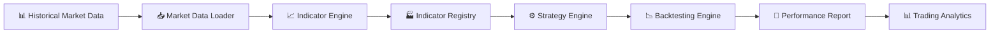
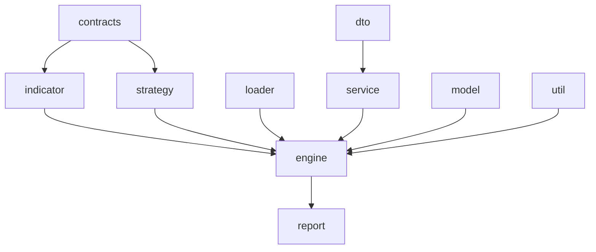
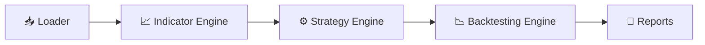
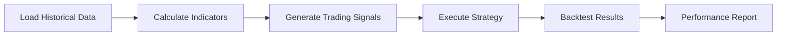
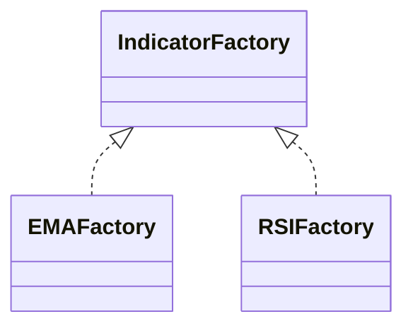
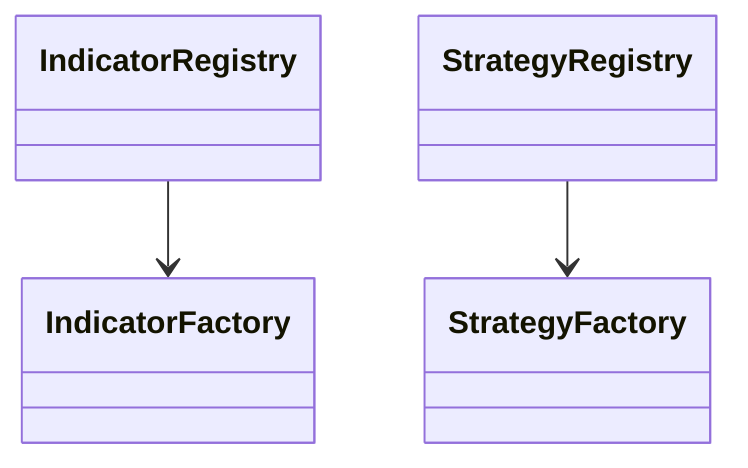
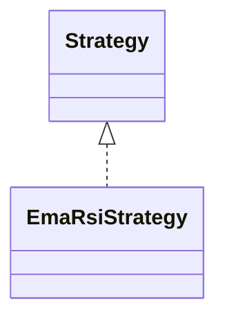
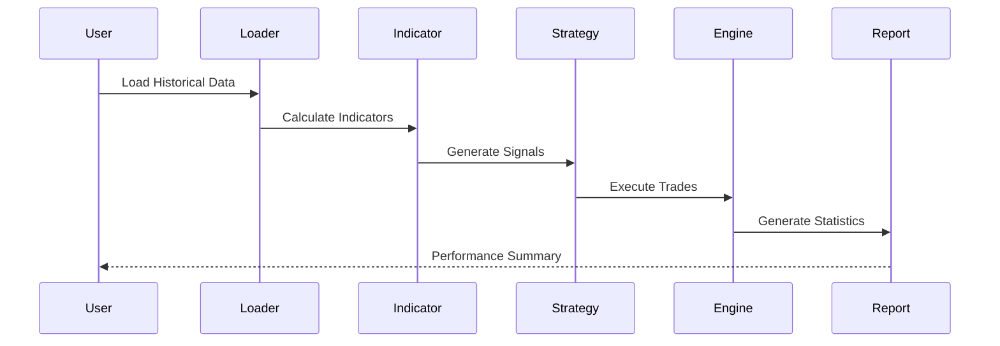
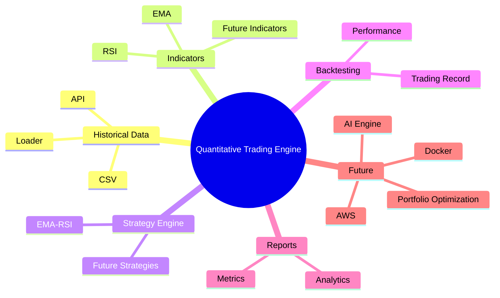

<!-- ========================================================= -->
<!--               QUANTITATIVE TRADING ENGINE                 -->
<!-- ========================================================= -->

<div align="center">

# 📈 Quantitative Trading Engine

### Production-Grade Quantitative Trading & Backtesting Engine

<p>
Built with <strong>Java</strong>, <strong>Spring Boot</strong>, and <strong>TA4J</strong>
</p>

<p>


</p>

<p>

<strong>Historical Data</strong> •
<strong>Technical Indicators</strong> •
<strong>Strategy Engine</strong> •
<strong>Backtesting</strong> •
<strong>Performance Reports</strong>

</p>

</div>

---

## 🚀 Overview

**Quantitative Trading Engine** is an enterprise-grade backend trading engine designed for developing, testing, and evaluating quantitative trading strategies.

The project combines **Java**, **Spring Boot**, and **TA4J** to provide a modular architecture for historical market data processing, technical indicator calculation, strategy execution, and historical backtesting.

## ⚡ Why This Project?

It is a **production-grade quantitative trading engine** built to design, test, and evaluate trading strategies with a strong focus on **performance, scalability, and clean architecture**.
---

## ⚙️ Why Java + TA4J?

Most trading prototypes are built in Python. That works for experimentation—but breaks at scale.

This project takes a different approach:

### ⚡ Performance First
- Native multi-threading (no GIL limitations)
- Parallel strategy backtesting
- Efficient large dataset processing

### 🧠 Strong Architecture
- Type-safe design
- Clear domain modeling
- Maintainable and extensible codebase

### 📈 Real Engineering Focus
- Not just charts or dashboards
- Focus on **core trading logic**
- Designed for **backend scalability**

---

## ✨ Key Features

| Feature | Description |
|----------|-------------|
| 📊 Historical Market Data | Load and process historical OHLC market data |
| 📈 Technical Indicators | Calculate EMA, RSI, and future technical indicators |
| ⚙️ Strategy Engine | Develop reusable trading strategies using TA4J |
| 📉 Historical Backtesting | Test strategies against historical datasets |
| 📄 Performance Reports | Generate detailed trading performance reports |
| 🏗 Modular Architecture | Enterprise-ready package structure |
| 🧩 Extensible Design | Easily add indicators and strategies |
| 🤖 AI Ready | Designed as the foundation for EquiSense AI |

---

## 🎯 Project Goals

- Build reusable quantitative trading strategies.
- Evaluate strategy performance using historical market data.
- Follow enterprise software engineering principles.
- Create an extensible engine for future indicators and strategies.
- Serve as the backend foundation for an AI-powered stock advisory platform.

---

## ⭐ Why This Project?

This project demonstrates practical knowledge of:

- Enterprise Java Development
- Spring Boot
- TA4J Integration
- Layered Architecture
- Factory Pattern
- Registry Pattern
- SOLID Principles
- Clean Code Practices
- Modular System Design
- Algorithmic Trading

It is designed to showcase software engineering skills that are commonly expected in production-grade backend systems.

---

## 📚 Quick Navigation

[🏗 Architecture](#-architecture) | [📦 Project Structure](#-project-structure) | [⚙ Technology Stack](#-technology-stack) | [🎨 Design Patterns](#-design-patterns) | [📊 Trading Workflow](#-trading-workflow) | [🚀 Getting Started](#-getting-started) | [🛣 Roadmap](#-roadmap) | [🤝 Contributing](#-contributing) | [📄 License](#-license)


---

<div align="center">

### ⭐ If you find this project useful, consider giving it a Star!

It motivates continued development and future enhancements.

</div>

---

# 🏗️ Architecture

The **Quantitative Trading Engine** follows a modular layered architecture that separates responsibilities into independent components. This design improves maintainability, scalability, and allows new trading strategies or indicators to be added with minimal code changes.



### ✨ Architecture Highlights

- Modular Layered Design
- Interface-Driven Development
- Loose Coupling
- Factory & Registry Patterns
- Easily Extensible
- Production-Oriented Structure

---

# 📦 Project Structure

```text
src
└── main
    └── java
        └── com.quantitative.trading
            ├── config
            ├── contracts
            ├── indicator
            ├── strategy
            ├── loader
            ├── engine
            ├── service
            ├── dto
            ├── model
            |── optimizer
            ├── report
            ├── util
            └── exception
```

---

## 📂 Package Overview

| Package | Responsibility |
|----------|----------------|
| ⚙️ config | Spring configuration and application setup |
| 📜 contracts | Interfaces for indicators, strategies, and loaders |
| 📈 indicator | Technical indicator implementations and factories |
| 🧠 strategy | Trading strategy implementations |
| 📥 loader | Historical market data loading |
| 🚀 engine | Core trading and backtesting engine |
| 🔧 service | Business logic |
| 📦 dto | Data Transfer Objects |
| 🧾 model | Domain models |
| 📊 report | Performance reporting |
| 🛠 util | Utility classes |
| ❗ exception | Custom exception handling |

---

# 🔗 Package Relationship



---

# 🏛️ High-Level Component View



---

# 🛠️ Technology Stack

| Technology | Purpose |
|------------|----------|
| Java 21 | Core Programming Language |
| Spring Boot | Backend Framework |
| TA4J | Technical Analysis Library |
| Maven | Dependency Management |
| Lombok | Boilerplate Reduction |
| Jackson | JSON Processing |
| SLF4J | Logging |
| Git | Version Control |
| GitHub | Source Code Hosting |

---

# 🔄 Trading Workflow



---

# 🎯 Design Philosophy

The project has been designed with the following engineering principles:

- ✅ Modular Architecture
- ✅ Separation of Concerns
- ✅ Interface-Based Programming
- ✅ Reusable Components
- ✅ High Maintainability
- ✅ Easy Testing
- ✅ Future Scalability

These principles make it straightforward to introduce new indicators, strategies, data sources, and reporting modules without affecting the existing codebase.

---
---

# 🎨 Design Patterns

The Quantitative Trading Engine follows several proven software design patterns to keep the codebase modular, maintainable, and easy to extend.

| Pattern | Purpose | Used In |
|----------|---------|---------|
| 🏭 Factory Pattern | Creates indicators and strategies without exposing implementation details | `EMAFactory`, `RSIFactory`, `StrategyFactory` |
| 📚 Registry Pattern | Central registry for reusable components | `IndicatorRegistry`, `StrategyRegistry` |
| 🎯 Strategy Pattern | Encapsulates trading algorithms | Trading Strategies |
| 💉 Dependency Injection | Loose coupling between components | Spring Boot |
| 📦 Interface-Based Design | Flexible architecture through abstractions | `contracts` package |

---

## 🏭 Factory Pattern

The Factory Pattern centralizes object creation, making it easy to introduce new indicators or strategies without modifying existing code.



### Benefits

- Easy to add new indicators
- Reduced code duplication
- Better scalability
- Cleaner architecture

---

## 📚 Registry Pattern

The Registry Pattern stores and manages all available indicators and strategies in one place.



### Benefits

- Centralized management
- Easy lookup
- Dynamic registration
- Simplified maintenance

---

## 🎯 Strategy Pattern

Trading logic is encapsulated inside individual strategy implementations.



This enables adding new strategies without changing the trading engine.

---

# 📐 SOLID Principles

| Principle | Implementation |
|------------|----------------|
| **S** Single Responsibility | Each package has one well-defined responsibility |
| **O** Open/Closed | New indicators and strategies can be added without modifying existing classes |
| **L** Liskov Substitution | Factory implementations can replace their interfaces |
| **I** Interface Segregation | Small, focused interfaces inside the `contracts` package |
| **D** Dependency Inversion | Core modules depend on interfaces rather than implementations |

---

# 🔄 Strategy Execution Flow



---

# 🧠 System Mind Map



---

# 🔍 Why This Architecture?

Unlike a traditional stock market application, this project is designed as a reusable trading engine.

### Key Engineering Decisions

- Interface-driven architecture for flexibility.
- Independent modules with clear responsibilities.
- Plug-and-play indicators and strategies.
- Minimal coupling between packages.
- Easily testable and maintainable components.
- Scalable foundation for future enhancements.

This architecture allows new functionality to be introduced with minimal impact on the existing codebase.

---

# 💼 What This Project Demonstrates

This repository showcases practical experience with:

- Enterprise Java Development
- Spring Boot
- Software Architecture
- Design Patterns
- SOLID Principles
- TA4J Integration
- Algorithmic Trading
- Backtesting Systems
- Modular Backend Design
- Clean Code Practices

---

# 🎯 Future Engineering Goals

- ✅ Portfolio Backtesting
- ✅ Walk-Forward Analysis
- ✅ Parameter Optimization
- ✅ Monte Carlo Simulation
- ✅ Docker Deployment
- ✅ AWS Deployment
- ✅ REST APIs
- ✅ Redis Caching
- ✅ Kafka Integration
- ✅ AI Recommendation Engine

## 👨‍💻 Author

**Rithish Chowdary**
---
